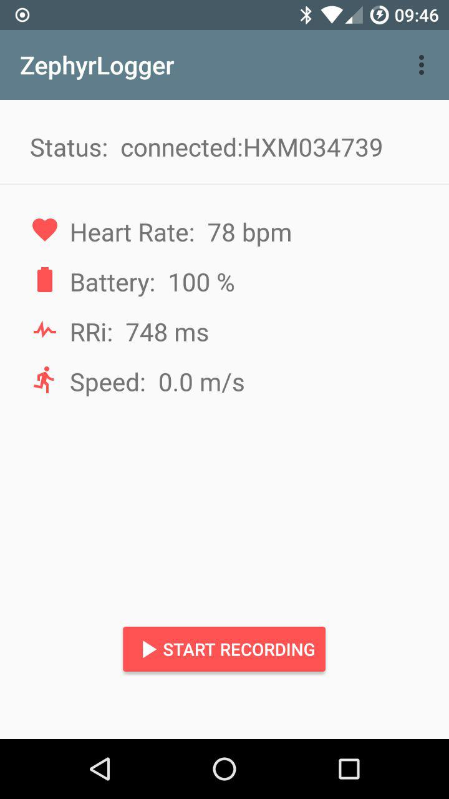

# ZephyrLogger

ZephyrLogger connects to the Zypher HxM heart rate monitor and logs the data from the device directly to a text file. This allows for in depth analysis of the heart rate data.

The data formats are available on the Zephyr website in the [api guide](https://www.zephyranywhere.com/media/download/hxm1-api-p-bluetooth-hxm-api-guide-20100722-v01.pdf).

## Screenshot

### Notes

This version of the app has been updated for newer versions of android. The UI has been reworked to be more readable and easier to use.

### Thanks to
[Pye Brook Company, Inc.](http://www.pyebrook.com)  info@pyebrook.com who developed the code on which this project is based.

## License
Licensed under the [Apache License, Version 2.0] (http://www.apache.org/licenses/LICENSE-2.0.html)

## Authors
* Created by Christian Orthmann
* Ian Mcxa
